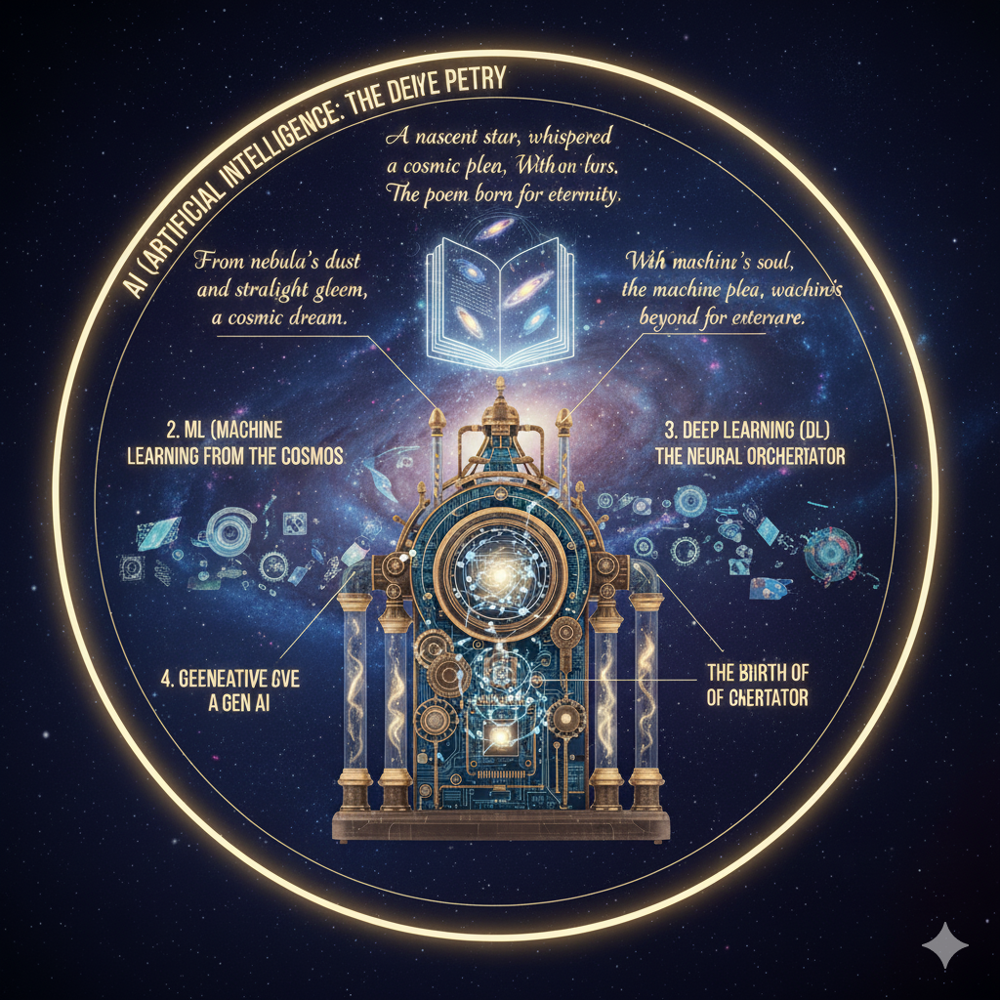
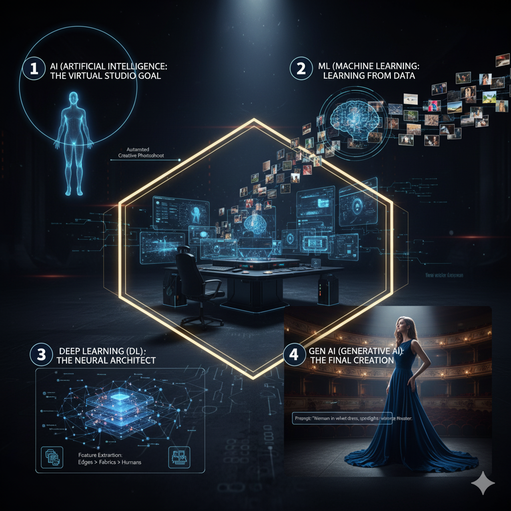

# Understanding AI, ML, DL, and Generative AI

---

## 1. What is AI, ML, DL, and Gen AI?

- **AI (Artificial Intelligence):**  
  The broad field where machines are designed to perform tasks that normally require human intelligence such as reasoning, learning, and language understanding.

- **ML (Machine Learning):**  
  A subset of AI where algorithms enable machines to learn patterns from data without explicit programming.

- **DL (Deep Learning):**  
  A subset of ML that uses deep neural networks (many layers) to model complex data patterns, widely used in image, audio, and language tasks.

- **Gen AI (Generative AI):**  
  AI focused on generating new content (text, images, music) by learning patterns from existing data.

Example:

# The Story of the Sundara Saree Design

A textile company wanted to launch a new line of traditional silk sarees. Instead of an expensive photoshoot, they used their AI system, called **"Silk Weaver."**

---

### AI (Artificial Intelligence): The Big Vision.

The AI goal was simple: Make a machine that can automatically create perfect, realistic marketing photos. This is the whole intelligent system.

---

### ML (Machine Learning): The Learning Step.

The system was fed lakhs of images of silk, colors, and designs. The ML algorithm looked at the data and learned the rules:  
- How does light shine on silk?  
- Which colors look good together?  

It learned what makes a photo look authentic.

---

### DL (Deep Learning): The Expert Eye.

This is the *Adhbhuta* (amazing) part. The DL engine used complex neural networks to understand the tiny details. It didn't just see "red saree"; it learned the exact depth of the gold thread, the delicate folds, and the soft shadow under the model's chin. It built a *Sundara* (beautiful) digital understanding of reality.

---

### Gen AI (Generative AI): The New Creation.

The designer types a prompt:  
> "A model in the new green saree, standing next to a temple pond during sunrise."

The Gen AI engine takes the DL's complex understanding and, in seconds, generates a completely new, unique, and realistic photo. The saree drapes perfectly, the lighting is beautiful, and the image is instantly ready for social media.

---

## 2. How Are They Related?

- AI is the umbrella term.
- ML is a method to achieve AI by learning from data.
- DL is a powerful type of ML using deep neural networks.
- Gen AI typically uses DL and foundation models to generate new content.

---

## 3. Types or Techniques in Deep Learning (DL)

- **Feedforward Neural Networks (FNN):** Basic neural nets where data flows one way.
- **Convolutional Neural Networks (CNN):** Specialized for image and spatial data.
- **Recurrent Neural Networks (RNN):** Handle sequential data like text or time series.
- **Long Short-Term Memory (LSTM) & GRUs:** Improved RNNs that remember long sequences.
- **Transformers:** Advanced models that process sequences in parallel, very effective for language tasks.
- **Autoencoders:** Unsupervised models for learning data representations.
- **Generative Adversarial Networks (GANs):** Two competing networks generating realistic data.
- **Self-Supervised Learning:** Learning useful representations without labeled data.

---

## 4. Types of Model Training

- **Supervised Learning:** Trained on labeled data (input-output pairs).
- **Unsupervised Learning:** Finds patterns in unlabeled data.
- **Semi-Supervised Learning:** Uses a small labeled set plus large unlabeled data.
- **Reinforcement Learning:** Learns via rewards from interacting with an environment.
- **Self-Supervised Learning:** Learns by generating its own labels from the input data.

---

## 5. What is Generative AI (Gen AI)?

Generative AI models create new data by learning patterns in existing data, enabling them to generate realistic text, images, music, or code.

---

## 6. What are Foundation Models?

- Large pre-trained AI models trained on massive, diverse datasets.
- Serve as a “foundation” for many tasks after fine-tuning.
- Examples:  
  - **GPT (Generative Pre-trained Transformer)** — text generation  
  - **BERT (Bidirectional Encoder Representations from Transformers)** — language understanding  
  - **DALL·E** — image generation from text prompts  
  - **CLIP** — connecting text and images  
  - **PaLM** — Google’s large language model  

---

## 7. How Generative AI Uses Foundation Models

- Gen AI builds on foundation models pre-trained on massive data.
- These models are fine-tuned or prompted for specific generative tasks.
- This approach enables the generation of highly relevant and creative outputs.

---

# Summary Table

| Term             | Definition                              | Relation to Others          | Examples                  |
|------------------|---------------------------------------|-----------------------------|---------------------------|
| AI               | Machines performing intelligent tasks | Umbrella                    | Any intelligent system    |
| ML               | Learning from data                     | Subset of AI                | Random Forest, Neural Nets|
| DL               | Deep neural networks                   | Subset of ML                | CNN, RNN, Transformer     |
| Gen AI           | AI that generates new content          | Uses DL + foundation models | GPT, DALL·E               |
| Foundation Models | Large pre-trained base models          | Base for Gen AI             | GPT, BERT, DALL·E, PaLM  |

---

If you want me to expand on any specific topic like **Transformers, Fine-tuning, or GANs**, just say the word!

