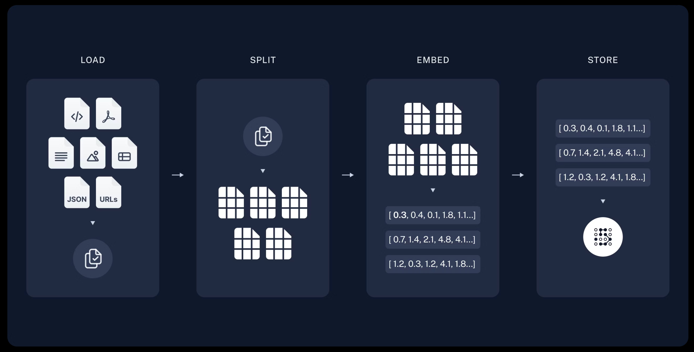
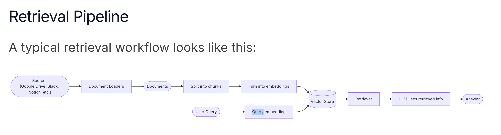
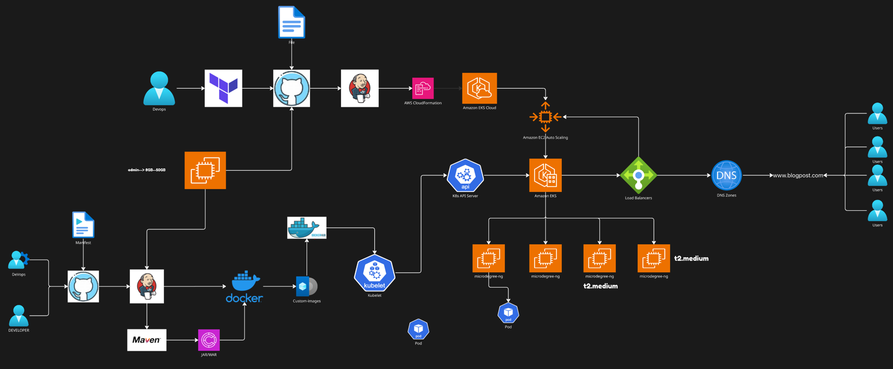

# Project Overview: Building a GenAI RAG Application

## 1. Objective

To develop a **Generative AI (GenAI)** application leveraging the **Retrieval-Augmented Generation (RAG)** approach. This application will enable context-aware, accurate responses based on internal document knowledge, improving productivity and information access across teams.

---

## 2. Architecture Summary

### ✅ Key Components:

- **Document Loading & Splitting**: Ingest internal documents (PDFs, Word, text files) and chunk them for efficient processing.
- **Embeddings with OpenAI**: Convert text chunks into vector embeddings using OpenAI's embedding models.
- **Vector Database (e.g., FAISS / Pinecone)**: Store embeddings for fast retrieval during inference.
- **RAG Pipeline (Chaining)**: On user query, relevant documents are retrieved from the vector DB and passed to the LLM for generating accurate, grounded responses.

---

## 3. Technology Stack & DevOps Pipeline

| Component         | Technology Used      | Purpose                                                                 |
|------------------|----------------------|-------------------------------------------------------------------------|
| Version Control   | **GitHub**           | Centralized codebase, version control, collaboration, CI/CD integration |
| Containerization  | **Docker**           | Package the app with dependencies for consistent environments           |
| Orchestration     | **Kubernetes (EKS)** | Scalable, fault-tolerant deployment of containers                       |
| Automation        | **Jenkins Pipeline** | Automate build, test, Dockerize, and deploy to EKS                      |

---

## 4. Why Use These Technologies

### 📂 GitHub

- Tracks code changes and branches effectively.
- Facilitates team collaboration and code review.
- Integrates seamlessly with Jenkins for CI/CD.

> ❌ *Without GitHub:* Hard to manage code versions, poor collaboration, lack of traceability.

---

### 📦 Docker

- Ensures the app runs the same in dev, test, and prod environments.
- Simplifies dependency management and deployment.

> ❌ *Without Docker:* Environment inconsistencies, manual setups, harder to scale or replicate.

---

### ☸️ Kubernetes (EKS)

- Automatically handles load balancing, scaling, and self-healing of services.
- EKS offers managed Kubernetes on AWS, reducing operational overhead.

> ❌ *Without Kubernetes:* Manual scaling and deployment, poor fault tolerance, downtime risk.

---

### 🔄 Jenkins Pipeline

- Automates the full software lifecycle: code to deployment.
- Triggers builds on GitHub commits, runs tests, builds Docker images, and deploys to EKS.

> ❌ *Without Jenkins:* Manual deployments, higher risk of errors, slower release cycles.

---

## 5. Purpose & Value of the RAG Application

- **Improved Search**: Users get accurate, up-to-date answers from internal documentation.
- **Reduced Manual Effort**: Saves time spent searching through files or asking SMEs.
- **Scalable Knowledge Assistant**: Empowers teams with AI-driven, context-aware insights.
- **Data Privacy**: Keeps sensitive enterprise data within the organization while using LLMs.

---

## 6. Business Impact

- Enhances internal productivity by **reducing time-to-information**.
- Decreases reliance on centralized knowledge holders.
- Lays the foundation for **enterprise AI transformation** with modular, scalable design.

---

## ✅ Next Steps

- Finalize document ingestion strategy and storage.
- Build embedding and retrieval pipeline.
- Set up CI/CD with GitHub + Jenkins.
- Containerize and deploy on EKS.
- Monitor, scale, and iterate based on feedback.

## Pipeline Architecture

